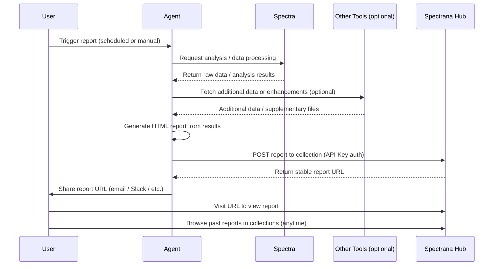
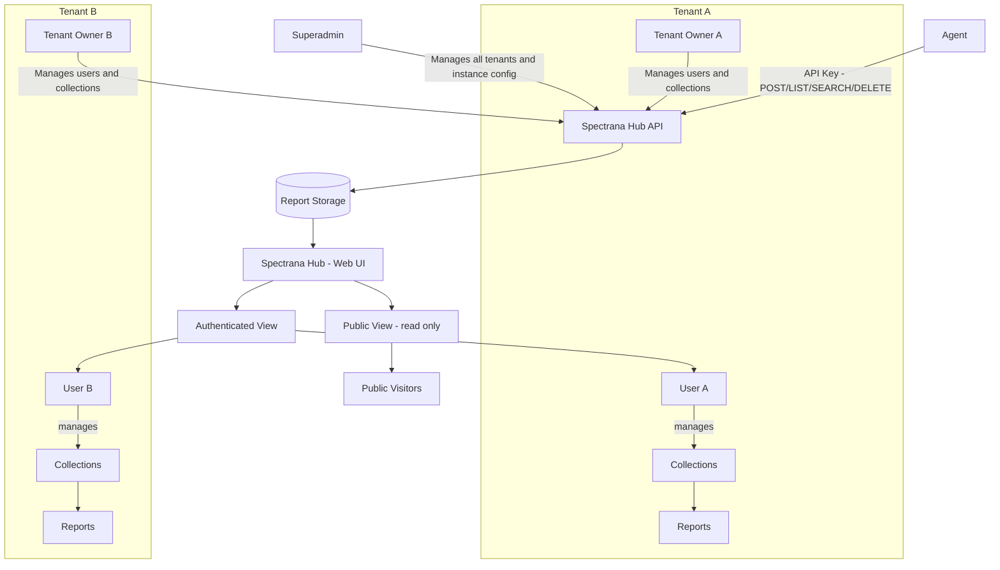
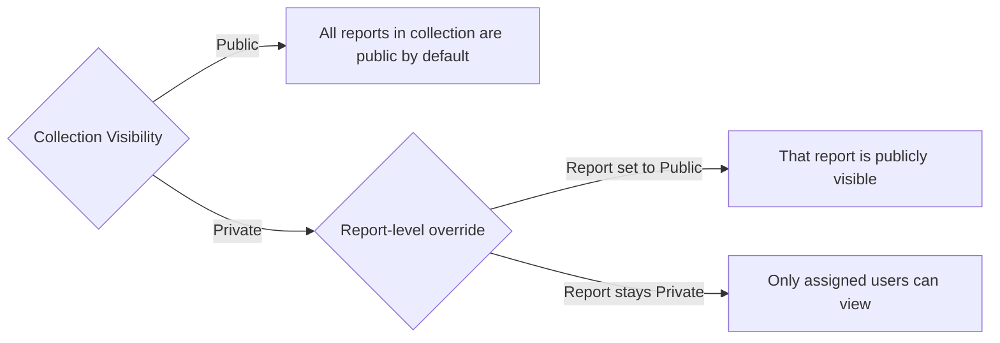

# PRD: Spectrana Hub

**Status:** Draft  
**Author:** Marwazi  
**Date:** 2026-05-10  
**Version:** 0.3

---

## 1. Overview

AI agents today can generate rich analytical reports using tools like Spectra and other enhancement tools. However, once a report is produced, there is no dedicated place for the agent to publish and store it. Reports are typically shared via email, which means users have no easy way to revisit past reports.

This document defines the requirements for a **Spectrana Hub** — a multi-tenant publishing platform that agents can push reports to via API, and users can browse and view at any time through a visually appealing, mobile-friendly web interface.

---

## 2. Problem Statement

- AI agents generate reports on behalf of users, but have **no publishing target** to store the final output.
- Users receive reports via email only, with **no archive or history** to revisit past reports.
- As report volume grows, email becomes an unreliable and unscalable way to manage report history.

---

## 3. Goals

- Provide a **secure API** that agents can use to publish reports using a user-level API key.
- Provide a **web interface** where users can browse and view all past reports, organized into collections.
- Each published report should have a **stable, shareable URL**.
- Support a primary report in **HTML format** with optional supplementary files (PDF, Excel, CSV, images, etc.).
- Support **multi-tenancy** so that each organization is fully isolated.
- Provide a **public view** for reports or collections marked as public.
- Provide **admin controls** for managing users and content.

---

## 4. Decisions & Constraints

| Topic | Decision |
|---|---|
| **Authentication** | Email + password (no SSO for now) |
| **Report expiry** | Configurable at tenant level — can be set to indefinite or a defined retention period |
| **Storage quota** | Configurable at tenant level, per user |
| **Agent trigger** | Both user-initiated and scheduled triggers are supported |
| **Public report URLs** | Slug-based (human-readable). Privacy is enforced by visibility settings, not URL obscurity |

---

## 5. Non-Goals (for now)

- Building or replacing Spectra itself — Spectrana Hub only stores and serves the output.
- Real-time or live report streaming.
- Report editing or regeneration from within Spectrana Hub.
- Agent interaction / chat inside Spectrana Hub.
- Notifications or subscriptions to new reports.
- Analytics on report views.

---

## 5. High-Level Flow



---

## 6. System Architecture (High Level)



---

## 7. Key Concepts

### 7.1 Tenant
A tenant represents an organization or company. Each tenant is fully isolated — users, collections, and reports from one tenant are never visible to another.

### 7.2 Collection
A collection is a named group of reports within a tenant. Think of it as a folder or a channel for reports (e.g., "Monthly Sales Reports", "Operations Dashboard").

- Each collection is owned by a user.
- Additional users can be assigned to a collection.
- A collection can be set as **Public** or **Private**.

### 7.3 Report
A report is the primary unit of content in Spectrana Hub. It consists of:

- A **main HTML file** — the rendered report output generated by the agent. Spectrana Hub has no control over its content or styling.
- Optional **supplementary files** — PDF, Excel, CSV, images, or any other associated files.
- **Metadata** — title, description, tags, publish date, visibility.

A report belongs to exactly one collection.

### 7.4 Visibility Model



- If a **collection is Public**, all reports within it are publicly accessible.
- If a **collection is Private**, reports are private by default.
- Within a Private collection, individual reports can be marked **Public** to allow public access.
- Public views are **read-only** — no editing, no collection management.

---

## 8. Key Components

### 8.1 Spectrana Hub API
- REST API consumed by agents.
- Authentication via **API Key** generated at the user level.
- An agent can only access collections **owned by the authenticated user**.
- Supported operations:

| Method | Endpoint | Description |
|---|---|---|
| GET | `/collections` | List all collections owned by the authenticated user |
| POST | `/collections/{id}/reports` | Submit a new report to a collection (defaults to unpublished) |
| PATCH | `/collections/{id}/reports/{report_id}/publish` | Publish a report (make it visible) |
| PATCH | `/collections/{id}/reports/{report_id}/unpublish` | Unpublish a report (hide from view without deleting) |
| GET | `/collections/{id}/reports` | List reports in a collection |
| GET | `/collections/{id}/reports?search=` | Search reports in a collection |
| DELETE | `/collections/{id}/reports/{report_id}` | Remove a report permanently |

- Agents **cannot** create, edit, or delete collections.
- A report submitted via API is **unpublished by default** — the agent must explicitly call the publish endpoint to make it visible.

### 8.2 Report Storage
- Stores the HTML report file and any supplementary files.
- Stores metadata per report.
- Supports multiple file types per report.

### 8.3 Spectrana Hub (Authenticated Web Interface)
- Visually appealing, mobile-friendly interface.
- Users log in and see their tenant's collections.
- Browse reports within collections, filter by date/tags.
- Users can manage their own collections (rename, set visibility, assign users).
- Report owners can publish or unpublish their own reports directly from the UI.
- Users can manage reports in their collections (publish, unpublish, hide, delete, set public/private).

#### Report Viewer
The report viewer is designed around two layers: the **report canvas** and the **control panel**.

- The **report canvas** renders the agent-generated HTML in full, taking up the primary viewing area. Spectrana Hub has no control over the content or styling of the HTML itself.
- A **control panel** is available to authenticated users, overlaid or docked alongside the report — similar to how a browser-based PDF viewer shows a toolbar while the document fills the rest of the screen.
- The control panel can be **collapsed or hidden**, allowing the user to view the report in a clean, distraction-free full-screen mode.
- When revealed, the control panel exposes actions and information relevant to the report:
  - Report metadata (title, description, date, tags, collection)
  - Publish / Unpublish toggle
  - Visibility setting (Public / Private)
  - Download supplementary files (PDF, CSV, Excel, images, etc.)
  - Share / copy report URL
  - Delete report
- The control panel is **only visible to authenticated users** with access to the report. Public visitors see the report canvas only, with no control panel exposed.

### 8.4 Public View
- A clean, read-only view for publicly accessible reports or collections.
- No login required for public content.
- No editing, no collection management.
- Designed for sharing with external stakeholders.

### 8.5 Superadmin Panel
- Manages the entire instance across all tenants.
- Full CRUD on tenants (create, configure, suspend, delete).
- Can view and manage any tenant's users and content.
- Can publish or unpublish any report across any tenant.
- Configures instance-level settings.
- Superadmin is not tied to any specific tenant.

### 8.6 Tenant Owner Panel
- Manages their own tenant only — no visibility into other tenants.
- Full CRUD on users within the tenant.
- Full CRUD on collections and reports within the tenant.
- Can publish or unpublish any report within the tenant.
- Configures tenant-level settings including:
  - Report retention / expiry policy.
  - Storage quota per user.

### 8.7 API Key Management
- Each user can generate and revoke API keys.
- API keys are scoped to the user — agents using a key can only access that user's collections.
- Multiple keys can be generated per user (e.g., per agent or use case).

---

## 9. User Roles & Permissions

```mermaid
flowchart TD
    SuperAdmin[Superadmin] -->|Full control over all tenants and instance| Spectrana Hub
    TenantOwner[Tenant Owner] -->|Full control within own tenant| Spectrana Hub
    CollectionOwner[Collection Owner] -->|Manage own collections and reports| Spectrana Hub
    CollectionOwner -->|Assign users to collection| CollectionMember
    CollectionMember[Collection Member] -->|View reports in assigned collections| Spectrana Hub
    PublicVisitor[Public Visitor] -->|View public reports only - no login| Spectrana Hub
    Agent -->|Post, list, search, delete reports via API Key| Spectrana Hub
```

| Role | Scope | Capabilities |
|---|---|---|
| **Superadmin** | Entire instance | Full CRUD on all tenants, users, and content; manages instance-level config |
| **Tenant Owner** | Own tenant only | Full CRUD on users, collections, and reports within their tenant; manages tenant-level config (retention, storage quotas) |
| **Collection Owner / Report Owner** | Own collections and reports | Creates and manages own collections; assigns members; sets collection visibility; publish or unpublish own reports |
| **Collection Member** | Assigned collections | Views reports in collections they have been assigned to |
| **Public Visitor** | Public content only | Read-only access to public reports/collections; no login required |
| **Agent (API Key)** | Owner's collections only | LIST collections; POST, PUBLISH, UNPUBLISH, LIST, SEARCH, DELETE reports; cannot create or manage collections |

---

## 10. User Stories

### Agent
| As an... | I want to... | So that... |
|---|---|---|
| Agent | List all my collections | I can find the right collection to post a report to |
| Agent | POST a report (HTML + supplementary files) to a collection | The report is stored and accessible via a URL |
| Agent | Receive a stable URL after posting | I can share it with the user |
| Agent | List reports in a collection | I can check what has already been published |
| Agent | Search reports in a collection | I can find a specific report |
| Agent | Publish a report in a collection | The report becomes visible to users |
| Agent | Unpublish a report in a collection | The report is hidden from view without being deleted |
| Agent | Delete a report from a collection | I can remove outdated or incorrect reports permanently |

### User
| As a... | I want to... | So that... |
|---|---|---|
| User | Browse my collections | I can find and access my reports |
| User | View a report in my browser | I don't need to dig through emails |
| User | Share a report URL with colleagues | Others can view the same report |
| User | Set a collection to Public or Private | I control who can access the reports |
| User | Make a specific report public within a private collection | I can selectively share individual reports |
| User | Assign team members to my collection | They can access the reports I share with them |
| User | Generate an API Key | My agent can publish reports on my behalf |
| Report Owner | Publish a report I own via the UI | I can make it visible without relying on the agent |
| Report Owner | Unpublish a report I own via the UI | I can hide it from view without deleting it |

### Tenant Owner
| As a... | I want to... | So that... |
|---|---|---|
| Tenant Owner | Manage all users in my tenant | I can control who has access |
| Tenant Owner | Publish or unpublish any report within my tenant | I can control what is visible to users |
| Tenant Owner | Hide or delete any report or collection within my tenant | I can moderate content |
| Tenant Owner | Configure retention policy and storage quotas | I can manage resources for my tenant |

### Superadmin
| As a... | I want to... | So that... |
|---|---|---|
| Superadmin | Create and manage tenants | I can onboard new organizations |
| Superadmin | View and manage any tenant's users and content | I can support and moderate the platform |
| Superadmin | Publish or unpublish any report across any tenant | I can enforce platform-wide content standards |
| Superadmin | Configure instance-level settings | I can control global platform behavior |

---

## 11. Report Metadata Schema (Draft)

```json
{
  "title": "Monthly Sales Report - April 2026",
  "description": "Sales performance breakdown by region",
  "tags": ["sales", "monthly", "april-2026"],
  "visibility": "private",
  "status": "unpublished",
  "main_file": {
    "type": "html",
    "content": "<html>...</html>"
  },
  "supplementary_files": [
    { "name": "raw-data.csv", "type": "csv", "content": "..." },
    { "name": "summary.pdf", "type": "pdf", "content": "..." },
    { "name": "chart.png", "type": "image", "content": "..." }
  ]
}
```

---

## 12. Open Questions

- Should the Tenant Owner role be assigned to the first user who registers under a tenant, or explicitly provisioned by the Superadmin?
- Should there be a self-service tenant registration flow, or is tenant creation Superadmin-only?
- What happens to a tenant's reports and collections when the tenant is deleted — soft delete or hard delete?
- Should slug-based report URLs include the tenant name for namespacing (e.g., `/acme/collection-slug/report-slug`)?

---

*This is a living document and will be updated as the design evolves.*
